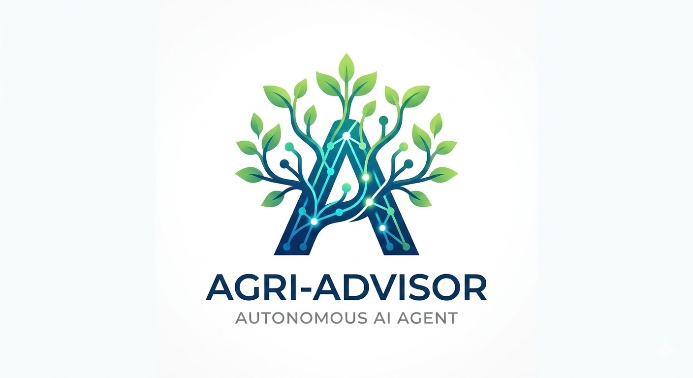

  <h1>Hi there, I'm Amit! 🚀</h1>
  
<b>Data Science and Engineering Student @ Technion | software Engineering, AI and Big Data Enthusiast</b>

---

### 📖 About Me
I am a Data Science and Engineering student at the **Technion - Israel Institute of Technology**, specializing in building high-performance data systems and AI models. My academic background is rooted in core computer science and engineering principles, including **Data Structures**, **Operating Systems**, **Computer Organization**, and **Machine Learning**.

I focus on developing end-to-end products that solve complex challenges through data—from autonomous AI agents to large-scale analytical platforms. My professional discipline stems from my service in the **Artillery Corps Forward Command Team (Hafak Magad)**, where I managed critical command-and-control systems in high-pressure environments.

---

### 🛠️ Technical Toolbox

| Category | Technologies |
| :--- | :--- |
| **Languages** | Python, SQL, C, R, Java, HTML/CSS |
| **AI & Data** | LangChain, PySpark, Databricks, BERT NLP, Scikit-learn |
| **Backend** | FastAPI, Flask, PostgreSQL, Supabase |
| **Vector DB** | Pinecone |

---

### 🌟 Featured Projects

<table border="0">
  <tr>
    <td width="300">
      
    </td>
    <td>
      <h4><b>Agri-Advisor Pro</b></h4>
      
An autonomous AI agent for Israeli farmers built on <b>ReAct architecture</b>. It utilizes a <b>RAG pipeline</b> with over 6,300 text chunks to provide real-time, data-driven agricultural advice.

      
<i>Tech: FastAPI, LangChain, Pinecone, OpenAI Tools</i>

    </td>
  </tr>
  <tr>
    <td width="300">
      
    </td>
    <td>
      <h4><b>Check-in To Reality</b></h4>
      
A Big Data platform analyzing the "Reality Gap" in the hotel industry. It processes <b>250,000+ records</b> using <b>PySpark</b> and <b>BERT Sentiment Analysis</b> to identify overrated properties.

      
<i>Tech: PySpark, Databricks, BERT, Flask, PostgreSQL</i>

    </td>
  </tr>
</table>

---

### 🎖️ Military Background
**Combat Soldier & Forward Command Team (Hafak Magad) | IDF Artillery Corps**
* Selected for the Battalion Commander's command team, operating real-time communication and command systems under extreme pressure.
* Developed high-stakes decision-making skills and the ability to bridge technical operations with field leadership.

---

### ⚡ Fun Facts
* 🍜 Massive fan of **Naruto**, **One-Punch Man**, and **My Hero Academia**.
* 🎯 I approach code optimization like a "Serious Punch"—maximum impact with zero wasted effort.

---

### 📫 Let's Connect!
* 📧 **Email:** amit22882036@gmail.com
* 💼 **LinkedIn:** www.linkedin.com/in/amit-gertner
* 🏗️ **Portfolio:** https://amit22882036-ship-it.github.io/amitProtfollio/

  

